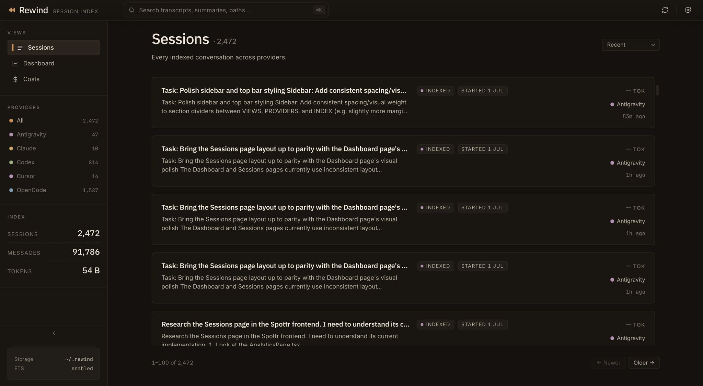
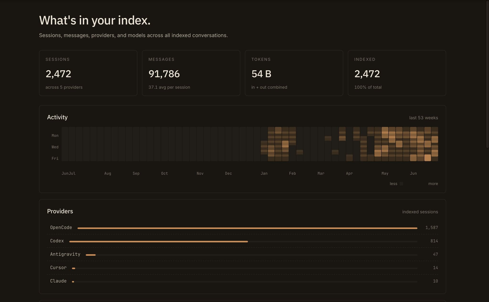
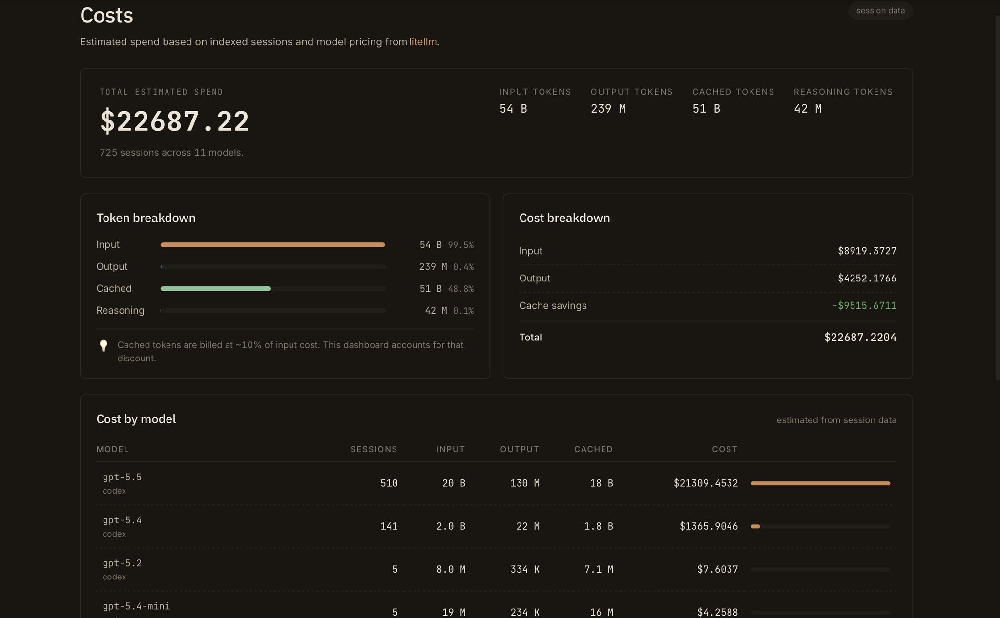
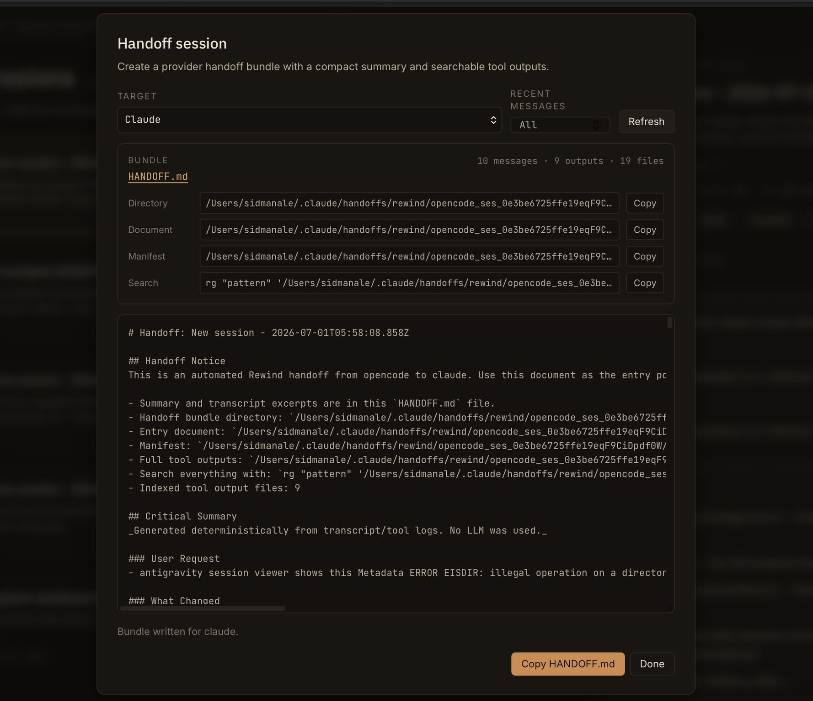

# Rewind View

Rewind View is a local search and browsing tool for your AI assistant sessions.

It indexes sessions from Claude, Codex, Cursor, OpenCode, and Antigravity into a local SQLite database. You can search old transcripts, browse session details, inspect usage, estimate costs, and create handoff bundles when you want to continue work in another assistant.

Everything stays on your machine by default. Rewind stores its data in `~/.rewind/data/rewind.sqlite`.

## Screenshots

<table>
  <tr>
    <td width="50%">
      <strong>Sessions</strong><br>
      Search and browse indexed sessions across providers.<br><br>
      
    </td>
    <td width="50%">
      <strong>Dashboard</strong><br>
      See sessions, messages, token usage, models, providers, and top repos.<br><br>
      
    </td>
  </tr>
  <tr>
    <td width="50%">
      <strong>Cost</strong><br>
      Estimate spend from indexed session usage and model pricing.<br><br>
      
    </td>
    <td width="50%">
      <strong>Handoff</strong><br>
      Create a handoff bundle so another assistant can continue from a past session.<br><br>
      
    </td>
  </tr>
</table>

## Quick start

```bash
npx rewind-view
```

On the first run, Rewind will:

- Find supported assistant session files on your machine.
- Parse and index the sessions.
- Store the index in `~/.rewind/data/`.
- Open the web UI in your browser.
- Keep the local server running until you press `Ctrl+C`.

## Install

### Run with npx

```bash
npx rewind-view
```

### Install globally

```bash
npm install -g rewind-view
rewind
```

### Run from source

```bash
git clone https://github.com/sidmanale643/rewind-view.git
cd rewind-view
npm install
npm run rewind
```

## What you can do

- Search transcripts across Claude, Codex, Cursor, OpenCode, and Antigravity.
- Browse session transcripts in a local web UI.
- Filter sessions by provider.
- Copy resume commands for providers that support them.
- View a dashboard of sessions, models, token usage, and repo activity.
- Estimate costs from indexed token usage.
- Create handoff bundles for Claude or Codex.
- Use CLI search and grep when you want results in the terminal.

## How it works

Rewind discovers session files from each supported provider and parses them into a common session format. It stores session metadata, transcript text, usage data, and source file information in SQLite.

Search uses SQLite FTS5, so it works locally without sending your transcripts to a remote service. Rewind tracks source file size, modified time, and content hashes so later runs can skip sessions that have not changed.

## Commands

Running `rewind` with no arguments starts the local web UI.

```bash
rewind
```

### Index sessions

```bash
rewind index
rewind index --provider claude
rewind index --rebuild
rewind index --discover-only
rewind index --data-dir ./my-data
```

| Flag | Default | Description |
| --- | --- | --- |
| `--provider` | `all` | Provider to index. Use `claude`, `codex`, `cursor`, `antigravity`, `opencode`, or `all`. |
| `--rebuild` | `false` | Re-index every session. |
| `--discover-only` | `false` | Record sessions in SQLite without marking them indexed. |
| `--data-dir` | `~/.rewind/data` | Storage directory. |

### Start the web UI

```bash
rewind serve
rewind serve --port 8080
rewind serve --host 0.0.0.0
rewind serve --public-url http://192.168.1.5:4820
rewind serve --data-dir ./my-data
```

The default web UI URL is `http://localhost:4820/ui`.

| Flag | Default | Description |
| --- | --- | --- |
| `--port` | `4820` | Port for the local server. |
| `--host` | `0.0.0.0` | Host for the local server. |
| `--public-url` | none | Public base URL for share links. |
| `--data-dir` | `~/.rewind/data` | Storage directory. |

### Search from the terminal

```bash
rewind search "OAuth login"
rewind search "react hooks" --provider claude -k 10
rewind search "deploy" --json
```

### Grep transcripts

```bash
rewind grep "useEffect"
rewind grep "error.*timeout" --context 3 --provider codex
```

### Create a handoff bundle

```bash
rewind handoff <session-id> --to claude
rewind handoff <session-id> --to codex --messages 20
rewind handoff <session-id> --to claude --print
```

| Flag | Default | Description |
| --- | --- | --- |
| `--to` | required | Target assistant. Use `claude` or `codex`. |
| `--messages` | `all` | Number of recent messages to include. The maximum is 100. |
| `--handoff-dir` | auto | Directory for the handoff bundle. |
| `--print` | `false` | Print `HANDOFF.md` content to stdout. |
| `--no-artifacts` | `false` | Skip writing handoff bundle files. |

### Inspect the index

```bash
rewind info
rewind doctor
```

## Supported session locations

| Provider | Default path |
| --- | --- |
| Claude | `~/.claude/projects/` |
| Codex | `~/.codex/sessions/` |
| Cursor | `~/.cursor/projects/` |
| OpenCode | `~/.local/share/opencode/opencode.db` |
| Antigravity | `~/.gemini/antigravity/brain/` |

## Configuration

You can pass `--data-dir` to any command, or set these environment variables.

| Variable | Default | Description |
| --- | --- | --- |
| `DATA_DIR` | `~/.rewind/data` | Storage directory for the SQLite database. |
| `PORT` | `4820` | Port for the web UI server. |
| `HOST` | `0.0.0.0` | Host for the web UI server. |
| `PUBLIC_URL` | none | Public base URL for share links. |

## Requirements

- Node.js 18 or newer.
- Local session files from at least one supported provider.

## Repository

Source code and issues are on GitHub:

https://github.com/sidmanale643/rewind-view

## License

MIT
